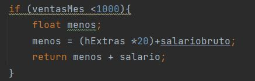

## Caso 1

En el primer caso debiamos crear una clase empleado , en este existian 3 tipos de empleado (VENDEDOR,ENCARGADO,NINGUNO) habian en juegos horas extra y las ventas por mes, a como se aprecia en la pantalla estan todos los casos de prueba que debiamos probar y sus resultados .

Primeramente cree la clase de tipo empleado la cual tendria dentro una funcion de tipo float la cual iba a calcular el salario neto en dependencia a las ventas del mes y las horas extras que hizo.

En este caso como era vendedor hize 3 condicionales el salario bruto era de 1000 .

si las ventas eran menor que 1000 no habian comisiones por lo cual solo sacamos el dinero de las oras extras con una mini funcion y retornamos el salario base mas el dinero de las horas extras como se muestra en la captura. 

En el caso de que las ventas fuera entre 1000 y 1499 al salario base se le suma 100 dolares de comision si era igual o mayor a 1500 la comision era de 200 luego solo sacaba el total utilizando la variable de horas extras por 20 dolares mas el salario bruto y lo retornaba.

En el caso del encargado las condiciones son las mismas lo unico que vario fue el salario que en este caso era de 1500 dolares.

## Caso 2

En este caso solo era sacar el salario neto en base a la retencion que se le haga al mismo .

Como dice el problema si el salario neto es menor que 1000 dolares solo retorno el mismo salario en caso que este entre 1000 y menor que 1500 habria una retencion del 16 % saco la retencion y retorno la resta del salario menos la retencion misma dentro la misma condicion .

En caso de que el salario fuera mayor de 1500 la comision seria del 18%  y la logica para sacarlo seria la misma con la diferencia solo de la retencion .

Hize un test de la funcion calcular salrio bruto solo para todos los Vendedores a como se muestra en la captura y todo esta correcto .

Hize un test de la funcion calcular salrio bruto solo para todos los encargados a como se muestra en la captura y todo esta correcto .

En un solo test realiza todo las pruebas de los salarios netos  y todos estan bien .